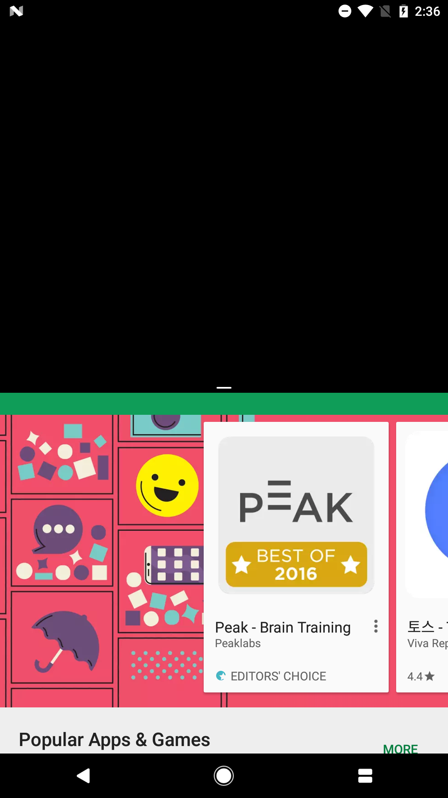

# SplitScreenTest

This project is made to demonstrate unexpected behavior of android application during split screen.

see https://code.google.com/p/android/issues/detail?id=231337 for more info & context.

# In brief:

## What happens

Activity lifecycle does not work well - or as expected.

## When does it happen

When an app is in split screen mode, and front activity is finished (by explicit `finish()` ) while user focus is in other app. 

# In longer words:

## What happens

Some activity lifecycle callbacks are not called. The app just stop middle of processes, resulting in look-like RTE. My first experience with this problem happened when 

1. App is running in split screen mode.
2. An activity is finished by server (remote) while user focus was not on the app (i.e. it was on the other app.)

Then what should happen was: activity finishes, main activity should start/resume, but what happend was: activity finishes, main activity does nothing. This resulted in no-view state of my app, and my app looked like it crashed, but it was still alive - just without a view (or window). The split screen mode was still not finished. I could tell this by seeing the overview button. It was still two rectangles, not one.

Unfortunately I cannot reproduce the above behavior, however, I was able to reproduce this project's error. What should happen in this project is as below

1. User can start `AActivity` by clicking a button on `MainActivity`.
2. `AActivity` calls `BActivity` on `onCreate()` . 
3. `BActivity` waits 1 second and calls `finish()`.
4. Since `BActivity` was called with `startActivityForResult`, `AActivity` receives response in `onActivityResult`. It calls `finish()` .
5. Then user should see `MainActivity`.

This scenario goes well when 

1. Split screen is not enabled
2. Split screen is enabled but user focus is on test app when it quits.

leaving below logs

```
01-03 14:32:06.274 17422-17422/com.example.cjeon.splitscreentest I/MainActivity: onCreate
01-03 14:32:06.347 17422-17422/com.example.cjeon.splitscreentest I/MainActivity: onStart
01-03 14:32:06.348 17422-17422/com.example.cjeon.splitscreentest I/MainActivity: onResume
01-03 14:32:09.222 17422-17422/com.example.cjeon.splitscreentest I/MainActivity: onPause
01-03 14:32:09.269 17422-17422/com.example.cjeon.splitscreentest I/AActivity: onStart
01-03 14:32:09.271 17422-17422/com.example.cjeon.splitscreentest I/AActivity: onResume
01-03 14:32:09.273 17422-17422/com.example.cjeon.splitscreentest I/AActivity: onPause
01-03 14:32:09.302 17422-17422/com.example.cjeon.splitscreentest I/BActivity: onStart
01-03 14:32:09.304 17422-17422/com.example.cjeon.splitscreentest I/BActivity: onResume
01-03 14:32:09.720 17422-17422/com.example.cjeon.splitscreentest I/AActivity: onStop
01-03 14:32:09.721 17422-17422/com.example.cjeon.splitscreentest I/MainActivity: onStop
01-03 14:32:10.320 17422-17422/com.example.cjeon.splitscreentest I/BActivity: onPause
01-03 14:32:10.330 17422-17422/com.example.cjeon.splitscreentest I/AActivity: onActivityResult: finish()
01-03 14:32:10.349 17422-17422/com.example.cjeon.splitscreentest I/MainActivity: onStart
01-03 14:32:10.349 17422-17422/com.example.cjeon.splitscreentest I/MainActivity: onResume
01-03 14:32:10.655 17422-17422/com.example.cjeon.splitscreentest I/AActivity: onDestroy
01-03 14:32:10.655 17422-17422/com.example.cjeon.splitscreentest I/BActivity: onStop
01-03 14:32:10.655 17422-17422/com.example.cjeon.splitscreentest I/BActivity: onDestroy
```

However, when split screen is on and user focus is not on the test app, app shows unexpected behavior like below log

```
01-03 14:06:16.042 9054-9054/com.example.cjeon.splitscreentest I/MainActivity: onCreate
01-03 14:06:16.120 9054-9054/com.example.cjeon.splitscreentest I/MainActivity: onStart
01-03 14:06:16.122 9054-9054/com.example.cjeon.splitscreentest I/MainActivity: onResume
01-03 14:06:21.064 9054-9054/com.example.cjeon.splitscreentest I/MainActivity: onPause
01-03 14:06:21.129 9054-9054/com.example.cjeon.splitscreentest I/MainActivity: onStop
01-03 14:06:21.129 9054-9054/com.example.cjeon.splitscreentest I/MainActivity: onDestroy
01-03 14:06:21.140 9054-9054/com.example.cjeon.splitscreentest I/MainActivity: onCreate
01-03 14:06:21.159 9054-9054/com.example.cjeon.splitscreentest I/MainActivity: onStart
01-03 14:06:21.160 9054-9054/com.example.cjeon.splitscreentest I/MainActivity: onResume
01-03 14:06:21.162 9054-9054/com.example.cjeon.splitscreentest I/MainActivity: onPause
01-03 14:06:25.351 9054-9054/com.example.cjeon.splitscreentest I/MainActivity: onResume
01-03 14:06:26.029 9054-9054/com.example.cjeon.splitscreentest I/MainActivity: onPause
01-03 14:06:26.103 9054-9054/com.example.cjeon.splitscreentest I/AActivity: onStart
01-03 14:06:26.105 9054-9054/com.example.cjeon.splitscreentest I/AActivity: onResume
01-03 14:06:26.107 9054-9054/com.example.cjeon.splitscreentest I/AActivity: onPause
01-03 14:06:26.132 9054-9054/com.example.cjeon.splitscreentest I/BActivity: onStart
01-03 14:06:26.134 9054-9054/com.example.cjeon.splitscreentest I/BActivity: onResume
01-03 14:06:26.452 9054-9054/com.example.cjeon.splitscreentest I/BActivity: onPause
01-03 14:06:26.487 9054-9054/com.example.cjeon.splitscreentest I/AActivity: onStop
01-03 14:06:26.489 9054-9054/com.example.cjeon.splitscreentest I/MainActivity: onStop
01-03 14:06:27.187 9054-9054/com.example.cjeon.splitscreentest I/BActivity: onStop
01-03 14:06:27.188 9054-9054/com.example.cjeon.splitscreentest I/BActivity: onDestroy
01-03 14:06:27.203 9054-9054/com.example.cjeon.splitscreentest I/AActivity: onStart
```

Screen shot of what happens:

The test app at the top, and google play at the bottom. Test app is malfunctioning. (But it did not crash. It's lifecycle callbacks just stopped.)




## Tested in

I have only one apk24+ device, so I was not able to test it any further. I tested this app in

Model: Pixel

Android version: 7.1.1

Kernel version: 3.18.31-gbd96fbf, android-build@wpix12.hot.corp.google.com#1

Build number: NMF260
